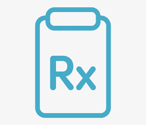
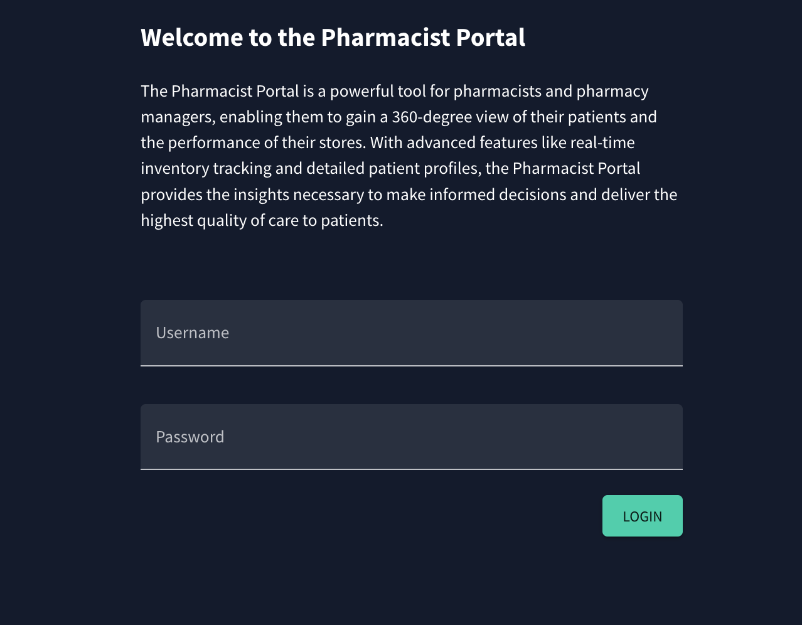

<!-- @format -->

# RxCare

<h1 align="center"> Retail Pharmacy Store Management System</h1>

<i>🏥 RxCare is a pharmacy management platform designed to provide store owners with an efficient and effective way to manage their pharmacy business.

<h3>Documentation / Demo</h3>

<ul>
<li><b>Documentation</b> coming soon <b>here</b></a></li>
<li><b>Demo</b> coming soon <b>here </b></a>
<ul>
<li><b>Login:</b> coming_soon</li>
<li><b>Password/LockPassword:</b>coming_soon</li>
</ul>
</li>
</ul>

<h3>Description</h3>

🏥 RxCare is a pharmacy management platform designed to provide store owners with an efficient and effective way to manage their pharmacy business. With a powerful suite of features, including patient management, inventory tracking, and AI-powered predictions, RxCare makes it easy for pharmacists to streamline their workflows and deliver the highest level of patient care.

👨‍⚕️ Our easy-to-use interface and comprehensive feature set allow pharmacists to focus on what they do best - caring for their patients. RxCare offers real-time visibility into inventory levels, patient data, and sales trends, enabling store owners to make data-driven decisions and optimize their pharmacy business.

💊 Whether you're running a single store or a chain of pharmacies, RxCare has the tools and features you need to succeed. From medication compounding to lab 360 and everything in between, RxCare is the ultimate pharmacy management solution. Try it today and see the difference it can make for your business!

<h3>Screenshots</h3>

<h4>Login Page: </h5>
</h4>
